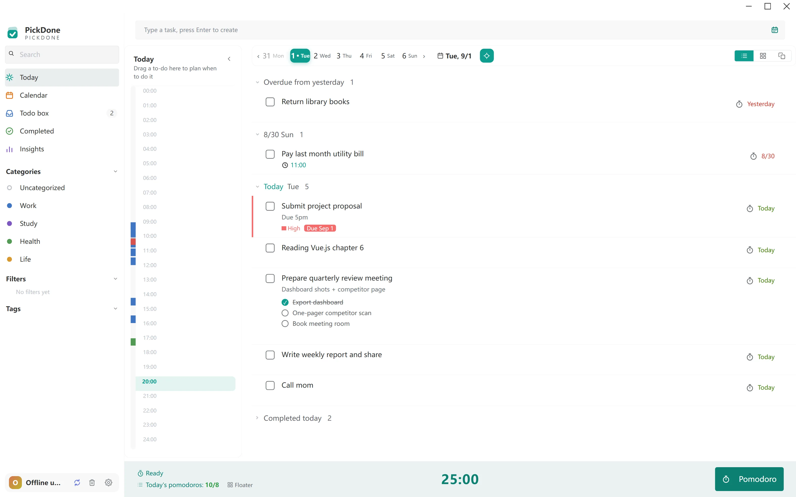
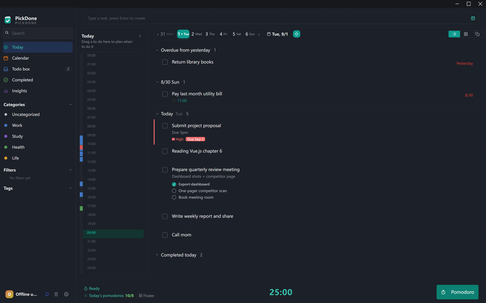
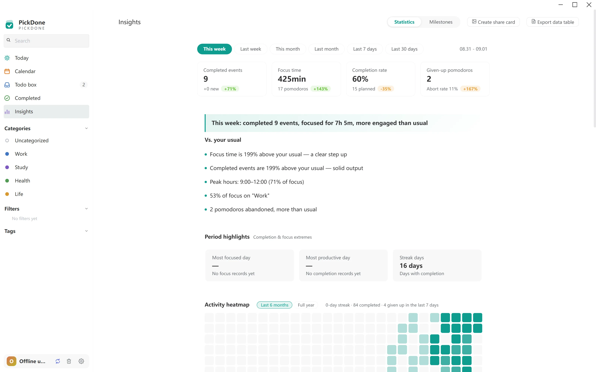
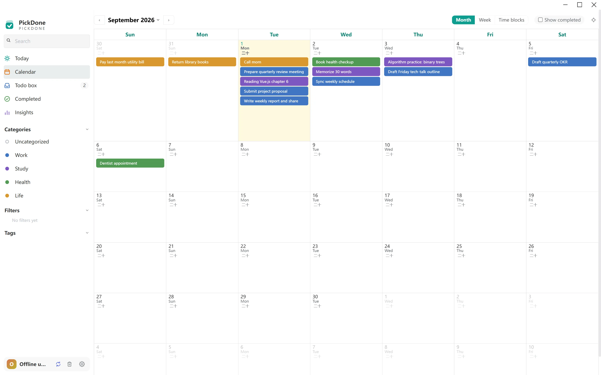
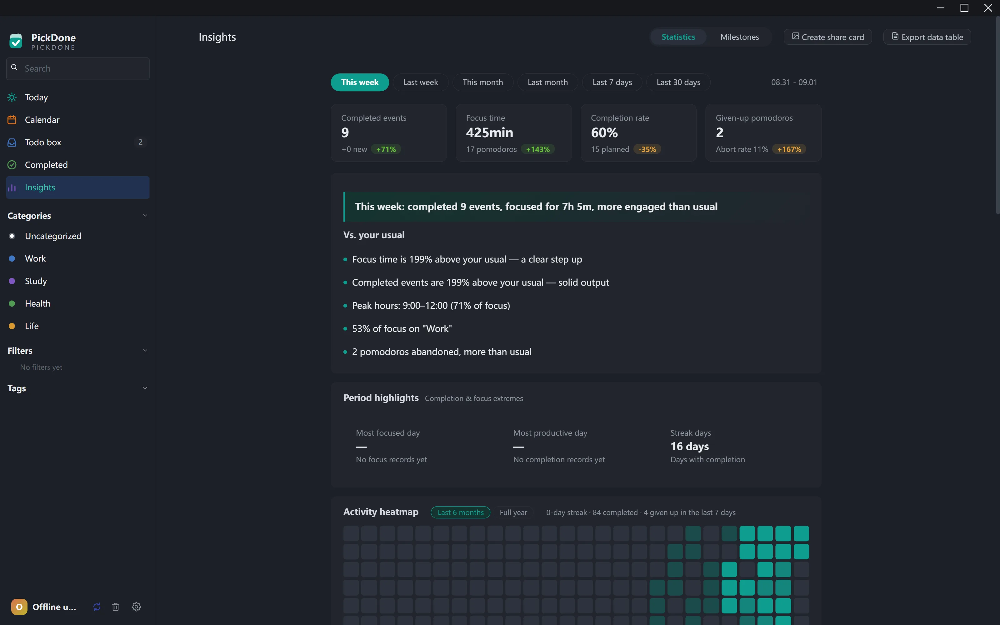
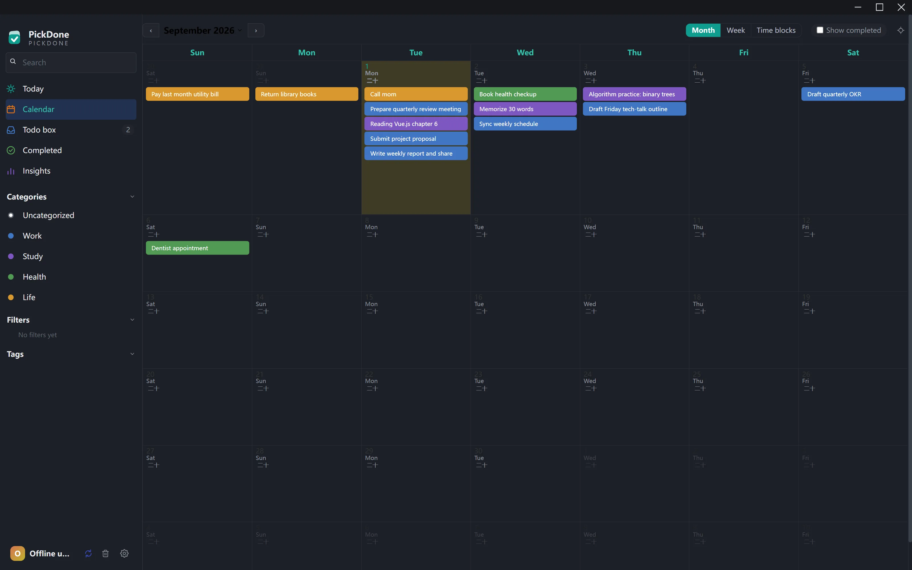
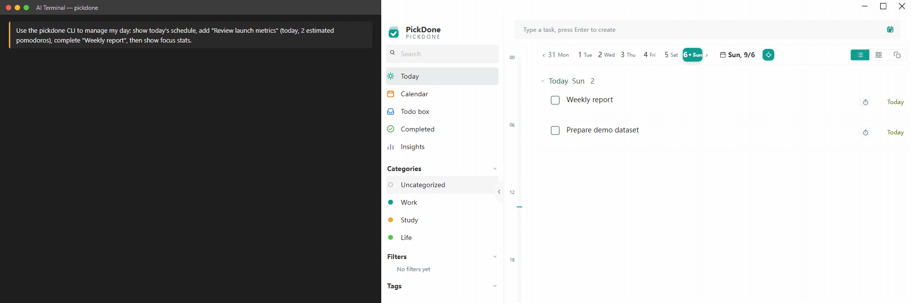

<div align="center">

**English** | [简体中文](./README.zh-CN.md)

# PickDone

**Plan, focus, review — to-dos, schedule and pomodoro in one flow, for Windows**

A built-in CLI lets you — and your AI assistant — manage the same tasks with the same commands.
Your data belongs to you: a single local SQLite file, zero accounts, zero network, ready the moment you launch it.

[](https://github.com/ardss/pickdone/actions/workflows/ci.yml)
[](LICENSE)
[]()
[]()
[]()

**[⬇️ Download latest](https://github.com/ardss/pickdone/releases)** · [Issues](https://github.com/ardss/pickdone/issues) · [Contributing](CONTRIBUTING.md) · [Code of Conduct](CODE_OF_CONDUCT.md)

</div>

---



## Why PickDone

- **Drag it in, focus, done** — drop a task on the timeline and it's scheduled; when the countdown ends, the session is booked back to that task automatically. From capture to done, you never have to keep anything in your head.
- **Reviews are narratives, not number walls** — weekly reports generated from your own history baseline tell you how the week went and what to change, without vanity metrics.
- **AI can do the work for you** — 20+ CLI primitives, all with `--json`; register them as tools in Claude / Cursor and your todos become delegable.
- **100% local data** — one encrypted SQLite file holds everything. No accounts, nothing leaves your machine; a backup file is a complete migration.

## Features

**🍅 Pomodoro focus** — 25+5 auto rotation, desktop floating timer, ambient sounds, completion chimes; a 24-hour dual-lane timeline replays your day: focus energy lane on the left colored by category, schedule lane on the right, click any block to re-attach a task; focus done outside the app can be backfilled with a right-click

**✅ Tasks** — today list with three views (list / Eisenhower matrix / card deck), todo box, schedule month calendar (lunar dates + holidays + drag to reschedule), recurring tasks (daily/weekly/monthly/yearly + lunar + skip-holiday), multiple reminders, subtasks, deadlines, recycle bin; key actions like complete/delete/move all carry a 5-second undo

**📈 Review** — narrative weekly report, activity heatmap, focus trends and interruption rate, per-task focus ranking, cross insights (e.g. focused but unfinished), period records, achievement badges, three share-card styles

**🧰 Desktop experience** — translucent calendar/todo widgets pinned to the desktop, global quick-add hotkey, launch at login, dark mode, English & Chinese UI, automatic backups (deduplication + GFS retention + snapshots before risky operations + one-click restore)

| Today (dark) | Review | Month calendar |
| --- | --- | --- |
|  |  |  |
|  |  |  |

## Download

Grab the latest build from [**Releases**](https://github.com/ardss/pickdone/releases):

| File | Description |
| --- | --- |
| `PickDone-Setup-x.y.z.exe` | Installer with in-app auto-update |
| `PickDone-Portable-x.y.z.exe` | Portable single executable; updates are manual |

The first-launch wizard walks you through UI language, color mode and the default list. New releases are checked automatically, downloaded in the background and applied on quit (Settings → General → Software Update to check manually).

## CLI: let AI manage your tasks

```bash
cd pickdone
node cli/pickdone.js overview              # today at a glance
node cli/pickdone.js list --undone         # open tasks
node cli/pickdone.js add "content" --date tomorrow
node cli/pickdone.js done "task keyword"
node cli/pickdone.js stats                 # focus summary
node cli/cli-smoke.js                      # self-test (isolated DB, never touches real data)
```

20+ commands cover tasks / subtasks / statistics / recycle bin. The CLI is plain JavaScript run by your system Node.js — have [Node.js](https://nodejs.org/) installed (any recent LTS works; the dev setup asks for ≥ 20). The installed app ships the same CLI at `resources/cli/pickdone.js`, and `node cli/pickdone.js skill install` registers a `pickdone` skill so local coding agents discover it automatically. Full contract in [pickdone/cli/SKILL.md](pickdone/cli/SKILL.md).



## Development

Requirements: Node.js ≥ 20 (22 recommended), Windows 10/11 (macOS / Linux unverified).

```bash
git clone https://github.com/ardss/pickdone.git
cd pickdone/pickdone
npm install
npm start          # launch the app
npm run dev        # dev mode (npm run app:dev isolates the data dir so a dev instance never touches real data)
npm run check      # ESLint + unit tests + CLI smoke
```

**Stack**: Electron 39 · Vue 3.5 · Element Plus · better-sqlite3 (encrypted) · Node built-in test runner

Data lives in `%APPDATA%/pickdone/todos.db` (encrypted SQLite); automatic backups default to `%APPDATA%/pickdone-backups/` (kept outside the data directory, location configurable). Uninstalling the app never deletes the data directory.

## Roadmap

Both architecture-level refactors are **done** (tracked historically in [docs/refactor-plan.md](docs/refactor-plan.md)):

- [x] **Unified style system** — converge the legacy CSS layers into a single token + utility system, clearing sedimented layers and naming conflicts
- [x] **SFC migration** — move JS template strings to `.vue` single-file components with a Vite build layer + TypeScript logic layer (done 2026-09-05; see `pickdone/README.md`)

Discussion and contributions welcome — please read the refactor plan and align on the approach before diving in.

Issues and PRs are welcome; see [CONTRIBUTING.md](CONTRIBUTING.md). Changelog: [CHANGELOG.md](CHANGELOG.md).

## License

[MIT](LICENSE) © 2026 ardss

Full third-party attributions (icons, sounds, etc.) are listed in [THIRD-PARTY-NOTICES.md](pickdone/THIRD-PARTY-NOTICES.md): ambient sounds and chimes come from [OpenGameArt](https://opengameart.org/) and [Kenney](https://kenney.nl/) (CC0 / CC-BY).
