<div align="center">

**简体中文** | [English](./README.md)

# 拾事 PickDone

**计划、专注、复盘——一气呵成的待办 · 日程 · 番茄桌面应用**

内置 CLI 管理接口,人和 AI 助手用同一套命令管理任务。
你的数据只属于你:一个本机 SQLite 文件,零账号、零联网、启动即用。

[](https://github.com/ardss/pickdone/actions/workflows/ci.yml)
[](LICENSE)
[]()
[]()
[]()

**[⬇️ 下载最新版](https://github.com/ardss/pickdone/releases)** · [问题反馈](https://github.com/ardss/pickdone/issues) · [参与贡献](CONTRIBUTING.md) · [行为准则](CODE_OF_CONDUCT.md)

</div>

---

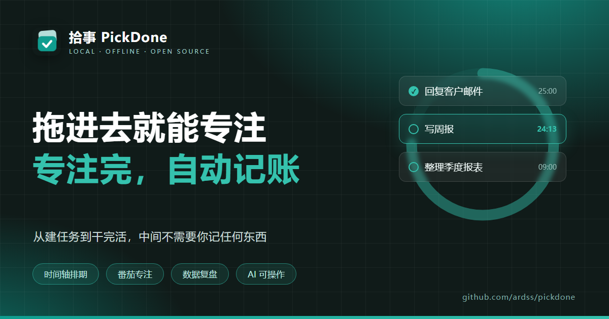

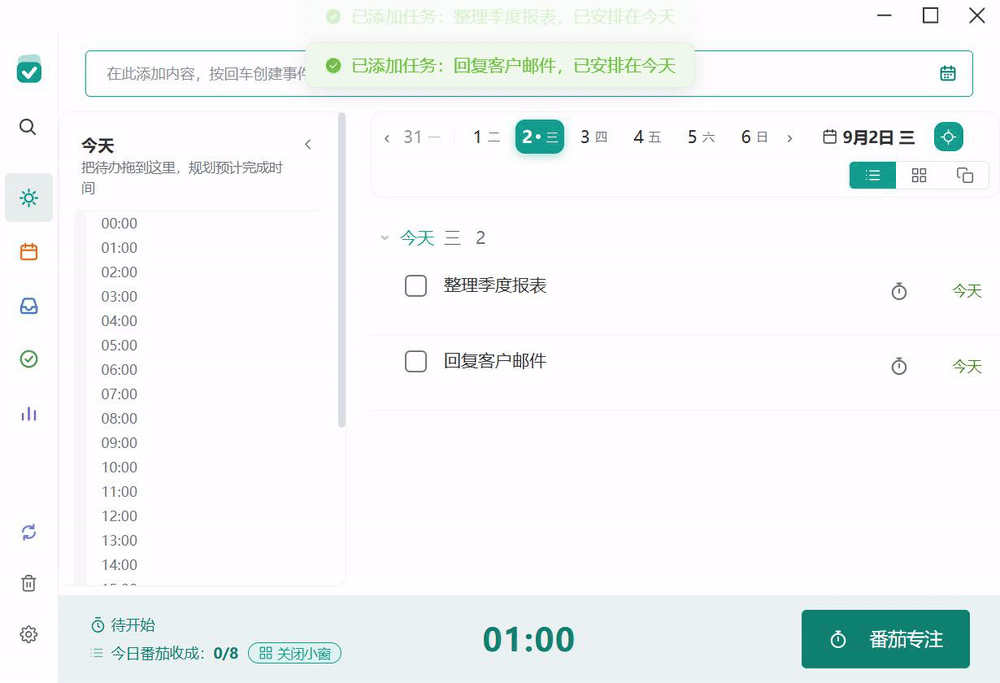

## 为什么是拾事

- **拖进去就能专注**:任务拖到时间轴上就排好了;专注倒计时走完,账自动记在这件事上——从建任务到干完活,中间不需要你记任何东西。
- **复盘是小作文,不是数字墙**:基于你自己的历史基线生成叙事式周报,告诉你"这周怎么样、下周怎么改",不堆虚荣指标。
- **AI 可以直接替你干活**:20+ 个 CLI 原语、全部支持 `--json`,注册成 Claude / Cursor 的工具,你的待办从此可以被托付。
- **数据 100% 在本机**:一个 SQLite 文件装下全部,零账号、零上传;备份文件即完整迁移。

## 功能

**🍅 番茄专注** —— 25+5 自动轮转、桌面悬浮窗、白噪音、提示音;专注过程全程可见,倒计时走完自动记账;24 小时时间轴双泳道复盘一天:左侧专注能量条按分类着色,右侧日程规划,点击时段即可更正关联任务;应用外的专注也能右键一键补录

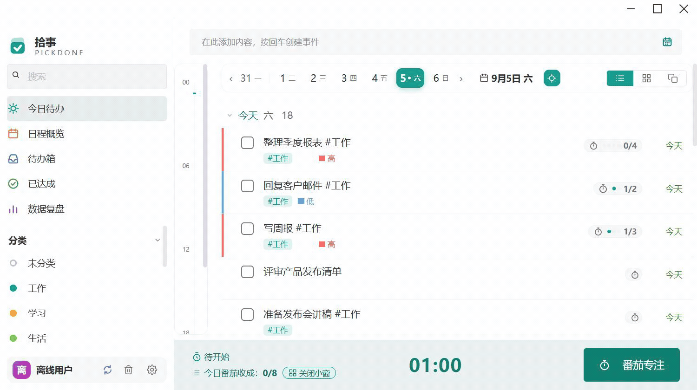

**✅ 任务管理** —— 今日清单三视图(列表 / 四象限矩阵 / 卡片堆叠)、待办箱、日程月历(农历 + 节假日 + 拖拽改期)、重复任务(天/周/月/年 + 农历 + 跳过节假日)、多重提醒、子任务、截止日期、回收站;完成/删除/移动日期等关键操作全部带 5 秒撤销

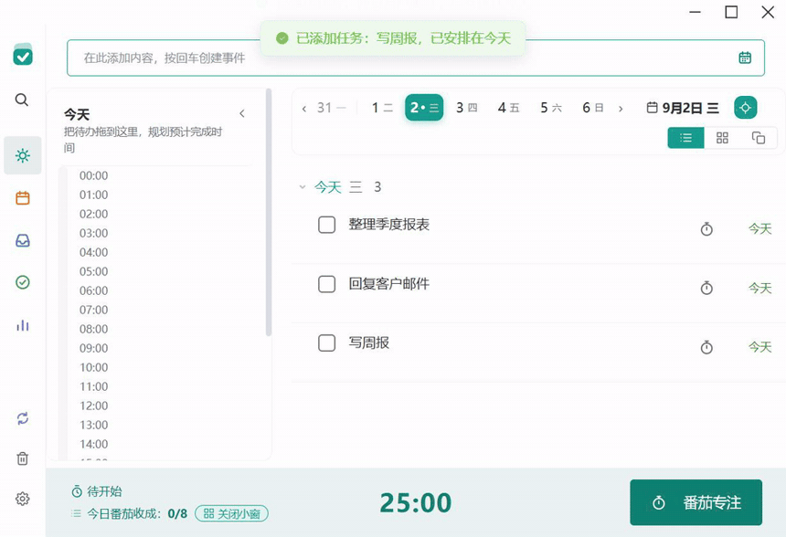

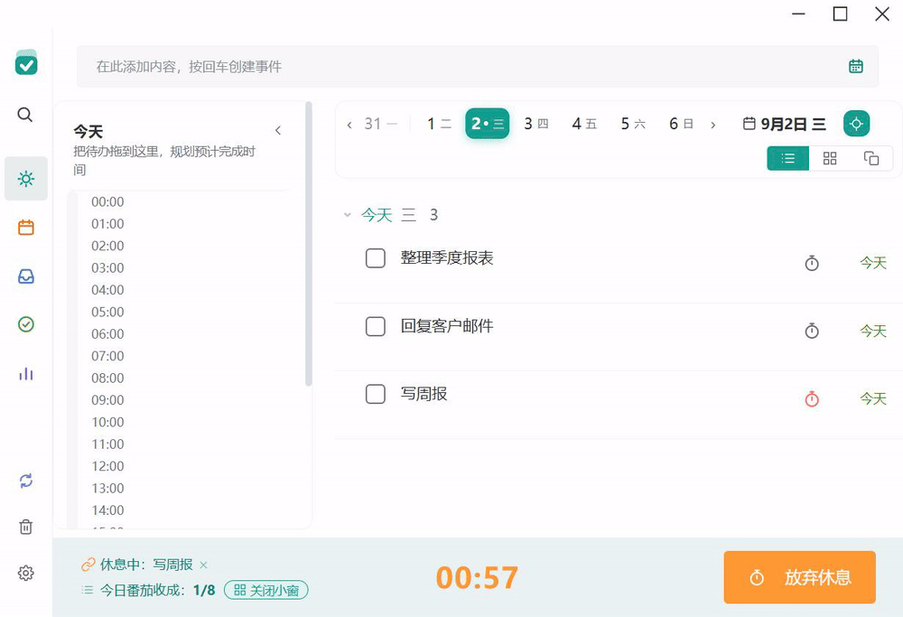

**📈 数据复盘** —— 叙事式周报、活跃热力图、专注趋势与中断率、任务级专注去向排行、交叉洞察(专注了却没完成等)、周期之最、成就徽章、三种分享卡片

**🧰 桌面体验** —— 半透明日历/待办小组件钉在桌面、全局快捷键快速添加、开机自启、深色模式、中英双语、自动备份(去重 + GFS 分级保留 + 危险操作前快照 + 一键从备份恢复)

| 今日(深色) | 数据复盘 | 日程月历 |
| --- | --- | --- |
| 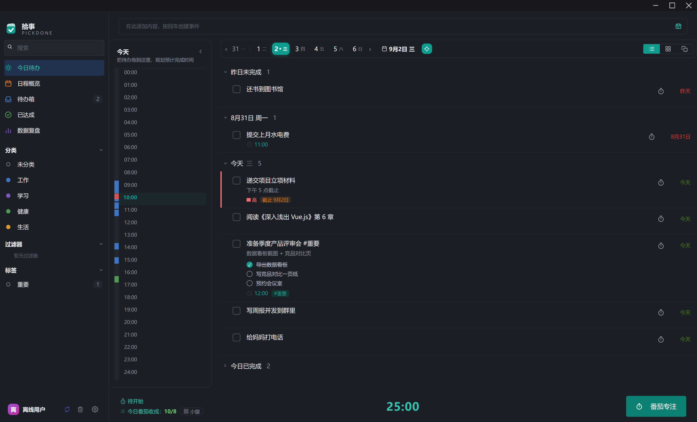 | 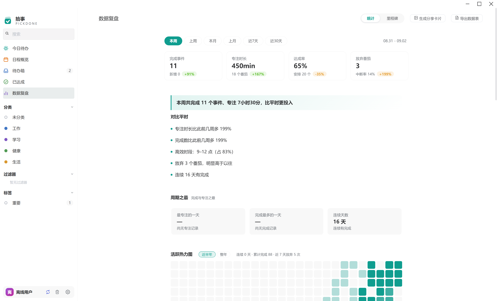 | 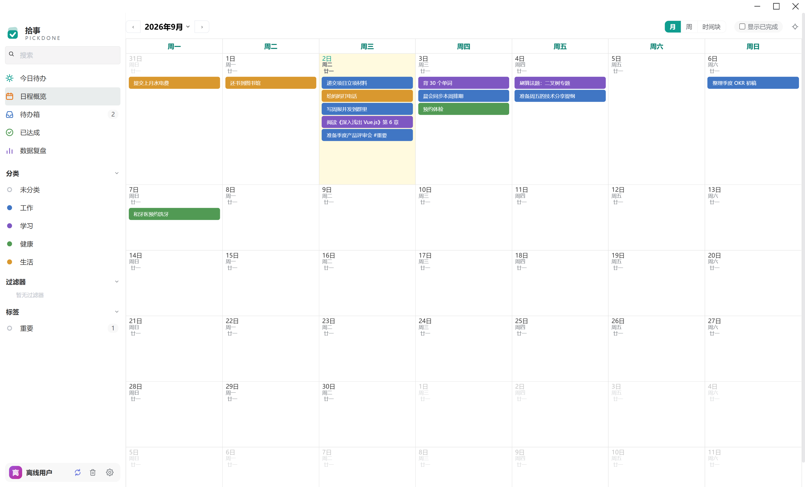 |
| 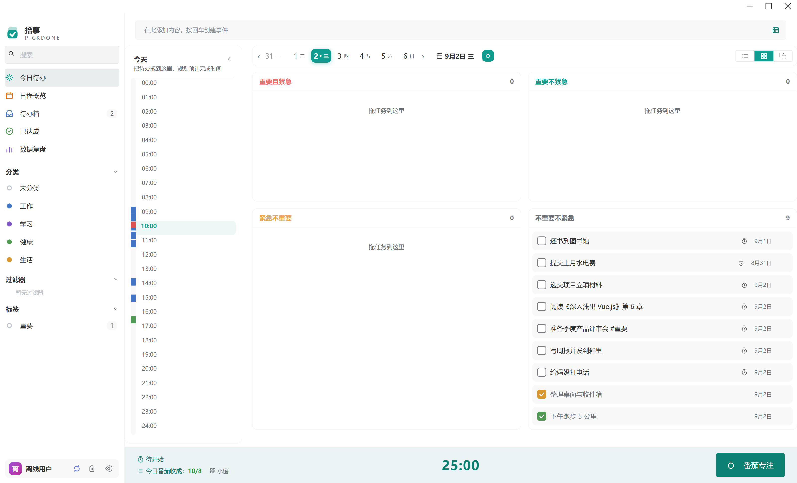 | 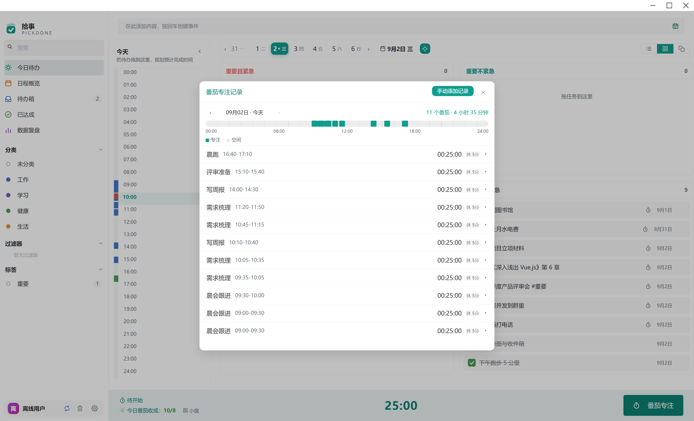 | 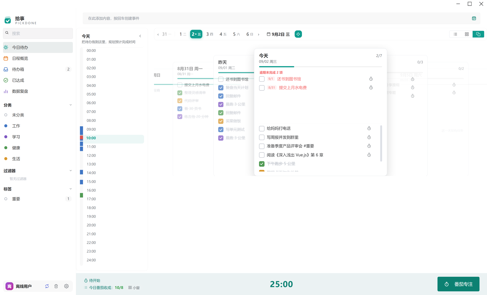 |

## 下载安装

到 [**Releases**](https://github.com/ardss/pickdone/releases) 下载最新版:

| 文件 | 说明 |
| --- | --- |
| `PickDone-Setup-x.y.z.exe` | 安装版,支持应用内自动更新 |
| `PickDone-Portable-x.y.z.exe` | 免安装便携版,单文件,更新需手动下载 |

双击安装,首次启动向导会引导选择界面语言、颜色模式与默认清单。新版本发布时应用会自动检查并在后台下载,退出时升级(设置 → 通用 → 软件更新可手动检查)。

## CLI:让 AI 替你管任务

```bash
cd pickdone
node cli/pickdone.js overview              # 今日总览
node cli/pickdone.js list --undone         # 未完成任务
node cli/pickdone.js add "内容" --date tomorrow
node cli/pickdone.js done "任务关键词"
node cli/pickdone.js stats                 # 统计概要
node cli/cli-smoke.js                      # 自测(隔离库,不碰真实数据)
```

20+ 命令覆盖任务 / 子任务 / 统计 / 回收站全域。CLI 是纯 JavaScript,由系统 Node.js 运行——请先安装 [Node.js](https://nodejs.org/)(任意较新版本均可,开发环境要求 ≥ 20)。安装版应用自带同一套 CLI(默认位于 `resources\cli\pickdone.js`,同目录 `resources\bin\pickdone.cmd` 是等价 shim),`node cli/pickdone.js skill install` 会把 pickdone 技能注册到本机 AI 编码工具可发现的技能目录。完整契约见 [pickdone/cli/SKILL.md](pickdone/cli/SKILL.md)。

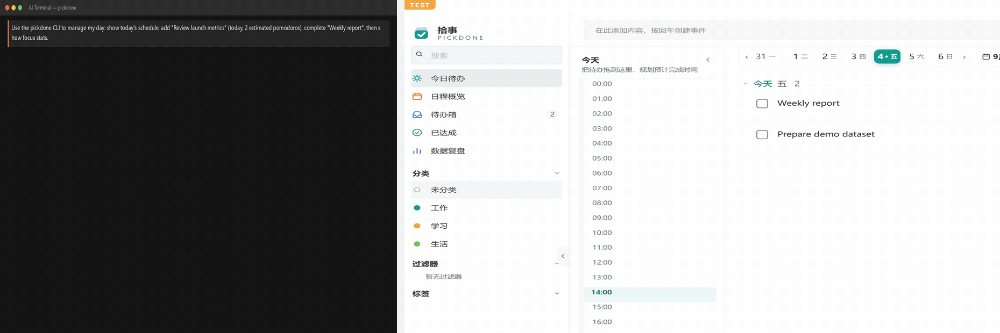

## 开发

要求:Node.js ≥ 20(推荐 22)、Windows 10/11(macOS / Linux 未验证)。

```bash
git clone https://github.com/ardss/pickdone.git
cd pickdone/pickdone
npm install
npm start          # 启动应用
npm run dev        # 开发模式（用 npm run app:dev 可隔离数据目录，避免开发实例直连真实数据）
npm run check      # ESLint + 单元测试 + CLI 冒烟
```

**技术栈**:Electron 39 · Vue 3.5 · Element Plus · better-sqlite3(加密)· Node 内置测试框架

数据存储在 `%APPDATA%/pickdone/todos.db`(SQLite,加密),自动备份默认位于 `%APPDATA%/pickdone-backups/`(与数据目录分离,位置可配置);卸载应用不会删除数据目录。

## Roadmap:两大重构

下一阶段的两项架构级重构,计划与进展记录在 [docs/refactor-plan.md](docs/refactor-plan.md):

- [ ] **样式体系统一** — 从多套历史 CSS 收敛为单一 token + 工具类体系,清空沉积层与双命名冲突
- [ ] **组件层 SFC 化** — 从 JS 模板字符串迁移到 `.vue` 单文件组件,引入构建层,打通 ESLint 对模板的检查能力

欢迎在这两项上讨论或贡献,动手前请先读重构计划文档并对齐方案。

欢迎提 Issue 与 PR,贡献流程见 [CONTRIBUTING.md](CONTRIBUTING.md);更新日志见 [CHANGELOG.md](CHANGELOG.md)。

## License

[MIT](LICENSE) © 2026 ardss

第三方组件与素材（图标、音效等）的完整署名清单见 [THIRD-PARTY-NOTICES.md](pickdone/THIRD-PARTY-NOTICES.md)：白噪音与提示音素材来自 [OpenGameArt](https://opengameart.org/) 与 [Kenney](https://kenney.nl/)（CC0 / CC-BY）。

